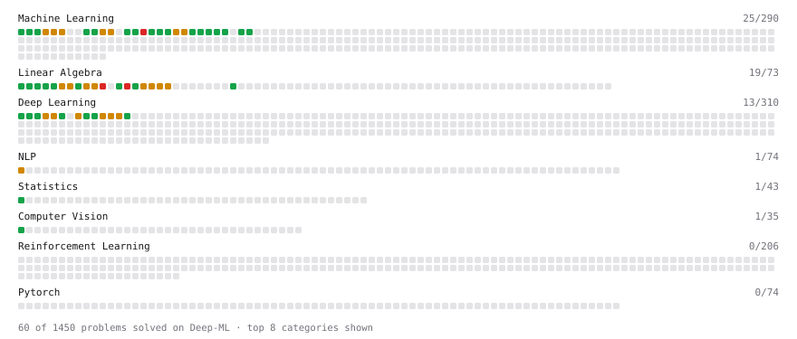

# Deep-ML

My machine learning practice from [Deep-ML](https://www.deep-ml.com). Every solution here was written by hand.

**33** solved · 33 problems · 0 labs · 0 math

[**Browse the interactive portfolio**](https://nqm314.github.io/deep-ml/) to replay this filling in over time.

## Problems

| | Difficulty | Solved | |
| --- | --- | --- | --- |
| [Batch Iterator for Dataset](https://www.deep-ml.com/problems/30) | easy | 2025-06-04 | [solution](problems/0030-batch-iterator-for-dataset) |
| [Calculate 2x2 Matrix Inverse](https://www.deep-ml.com/problems/8) | easy | 2025-01-09 | [solution](problems/0008-calculate-2x2-matrix-inverse) |
| [Calculate Accuracy Score](https://www.deep-ml.com/problems/36) | easy | 2025-06-06 | [solution](problems/0036-calculate-accuracy-score) |
| [Calculate Covariance Matrix](https://www.deep-ml.com/problems/10) | easy | 2025-01-11 | [solution](problems/0010-calculate-covariance-matrix) |
| [Calculate Mean by Row or Column](https://www.deep-ml.com/problems/4) | easy | 2025-01-03 | [solution](problems/0004-calculate-mean-by-row-or-column) |
| [Convert Vector to Diagonal Matrix](https://www.deep-ml.com/problems/35) | easy | 2025-06-06 | [solution](problems/0035-convert-vector-to-diagonal-matrix) |
| [Feature Scaling Implementation](https://www.deep-ml.com/problems/16) | easy | 2025-04-16 | [solution](problems/0016-feature-scaling-implementation) |
| [Implement ReLU Activation Function](https://www.deep-ml.com/problems/42) | easy | 2025-06-01 | [solution](problems/0042-implement-relu-activation-function) |
| [Linear Regression Using Gradient Descent](https://www.deep-ml.com/problems/15) | easy | 2025-04-16 | [solution](problems/0015-linear-regression-using-gradient-descent) |
| [Linear Regression Using Normal Equation](https://www.deep-ml.com/problems/14) | easy | 2025-03-17 | [solution](problems/0014-linear-regression-using-normal-equation) |
| [Matrix-Vector Dot Product](https://www.deep-ml.com/problems/1) | easy | 2025-01-01 | [solution](problems/0001-matrix-vector-dot-product) |
| [One-Hot Encoding of Nominal Values](https://www.deep-ml.com/problems/34) | easy | 2025-06-06 | [solution](problems/0034-one-hot-encoding-of-nominal-values) |
| [Random Shuffle of Dataset](https://www.deep-ml.com/problems/29) | easy | 2025-06-03 | [solution](problems/0029-random-shuffle-of-dataset) |
| [Reshape Matrix](https://www.deep-ml.com/problems/3) | easy | 2025-01-03 | [solution](problems/0003-reshape-matrix) |
| [Scalar Multiplication of a Matrix](https://www.deep-ml.com/problems/5) | easy | 2025-01-04 | [solution](problems/0005-scalar-multiplication-of-a-matrix) |
| [Sigmoid Activation Function Understanding](https://www.deep-ml.com/problems/22) | easy | 2025-04-21 | [solution](problems/0022-sigmoid-activation-function-understanding) |
| [Single Neuron](https://www.deep-ml.com/problems/24) | easy | 2025-05-29 | [solution](problems/0024-single-neuron) |
| [Softmax Activation Function Implementation ](https://www.deep-ml.com/problems/23) | easy | 2025-04-21 | [solution](problems/0023-softmax-activation-function-implementation) |
| [Transformation Matrix from Basis B to C](https://www.deep-ml.com/problems/27) | easy | 2025-06-02 | [solution](problems/0027-transformation-matrix-from-basis-b-to-c) |
| [Transpose of a Matrix](https://www.deep-ml.com/problems/2) | easy | 2025-01-02 | [solution](problems/0002-transpose-of-a-matrix) |
| [Calculate Eigenvalues of a Matrix](https://www.deep-ml.com/problems/6) | medium | 2025-01-05 | [solution](problems/0006-calculate-eigenvalues-of-a-matrix) |
| [Divide Dataset Based on Feature Threshold](https://www.deep-ml.com/problems/31) | medium | 2025-06-04 | [solution](problems/0031-divide-dataset-based-on-feature-threshold) |
| [Generate Sorted Polynomial Features](https://www.deep-ml.com/problems/32) | medium | 2025-06-05 | [solution](problems/0032-generate-sorted-polynomial-features) |
| [Implement K-Fold Cross-Validation](https://www.deep-ml.com/problems/18) | medium | 2025-04-18 | [solution](problems/0018-implement-k-fold-cross-validation) |
| [Implementing Basic Autograd Operations](https://www.deep-ml.com/problems/26) | medium | 2025-06-02 | [solution](problems/0026-implementing-basic-autograd-operations) |
| [K-Means Clustering](https://www.deep-ml.com/problems/17) | medium | 2025-04-17 | [solution](problems/0017-k-means-clustering) |
| [Matrix times Matrix ](https://www.deep-ml.com/problems/9) | medium | 2025-01-11 | [solution](problems/0009-matrix-times-matrix) |
| [Matrix Transformation ](https://www.deep-ml.com/problems/7) | medium | 2025-01-09 | [solution](problems/0007-matrix-transformation) |
| [Principal Component Analysis (PCA) Implementation](https://www.deep-ml.com/problems/19) | medium | 2025-04-19 | [solution](problems/0019-principal-component-analysis-pca-implementation) |
| [Single Neuron with Backpropagation](https://www.deep-ml.com/problems/25) | medium | 2025-06-01 | [solution](problems/0025-single-neuron-with-backpropagation) |
| [Solve Linear Equations using Jacobi Method](https://www.deep-ml.com/problems/11) | medium | 2025-01-12 | [solution](problems/0011-solve-linear-equations-using-jacobi-method) |
| [Singular Value Decomposition (SVD) of 2x2 Matrix](https://www.deep-ml.com/problems/12) | hard | 2025-01-20 | [solution](problems/0012-singular-value-decomposition-svd-of-2x2-matrix) |
| [SVD of a 2x2 Matrix](https://www.deep-ml.com/problems/28) | hard | 2025-06-03 | [solution](problems/0028-svd-of-a-2x2-matrix) |

---

_This file is regenerated by Deep-ML on every push._
